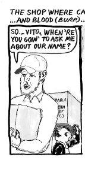
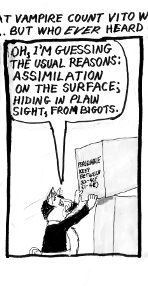

# Pizza from Scratch, Antisemitism 1

Wed Sep 09 2009

> Introducing kosher rabbi Joseph Hicks, employer of Count Vito and Contessa Cecilia, and neighborhood teenager, 'Bubba' Matsumoto
The shop where cat vampire Count Vito wokrs, dividing chickens, goats, and cows into cyborgs, meat, and blood (that last only for Count Vito and any other hungry vampires; Jews don't mess with blood.) ... But who ever heard of a kosher rabbi named Joe Hicks?
        